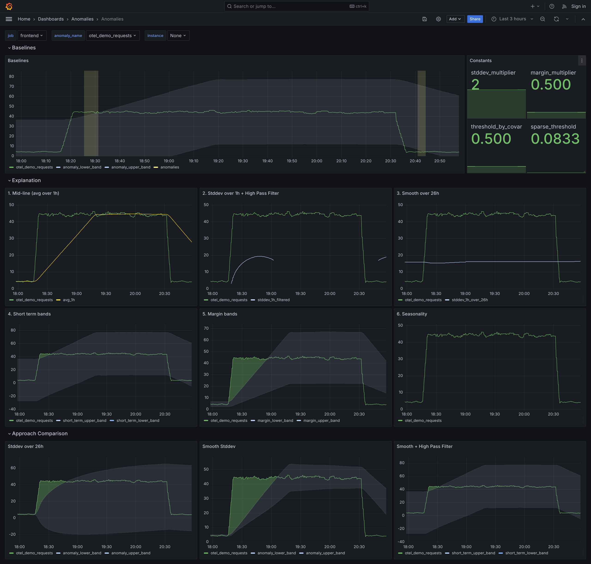

# PromQL Anomaly Detection Framework

Framework for anomaly detection in time series data using Prometheus/PromQL.

  - Does not require external systems.
  - Performant at scale.
  - Simple yet powerful.
  - Extensible.


## Getting Started

To see a demo of the framework in action, run the following commands:

```bash
cd demo
make start
```

You will need to have Docker installed to run the demo.  The demo will start a Prometheus instance, a Grafana instance, a node exporter instance and a version of the OTEL demo.

Once everything is running, head to [http://localhost:8080/grafana](http://localhost:8080/grafana) to access the Grafana UI. From there, you will find a dashboard called "Anomalies" within the "Anomalies" Folder.

The demo dashboard shows how any metric tagged with the `anomaly_name` and `anomaly_type` labels will be used used for anomaly detection and displayed in the dashboard.

<p align="center"></p>

You can simulate anomalies by altering the traffic patterns in the load generator, which can be accessed at [http://localhost:8080/loadgen/](http://localhost:8080/loadgen/).

## Usage

In order to use the framework, you will need to copy the recording and alerting rules to a folder accessible by your Prometheus instance, and update
your Prometheus configuration to use them.

For example, you could add the following to your Prometheus config file:

```yaml
rule_files:
- /etc/prometheus/rules/recording_rules.yml
- /etc/prometheus/rules/alerts.yml
```

In addition, you will need recording (or relabel) rules that tag your existing metrics for anomaly detection. Any metric with the `anomaly_name` and `anomaly_type` labels set will be considered for anomaly detection.

- `anomaly_name`: The name of the anomaly metric. This is used uniquely identify metrics.
- `anomaly_type`: It allows defining different thresholds and multipliers per metric type. The following types are supported by default:
  - `requests`: The request rate for a given service.
  - `latency`: The latency for a given service (for example, the 95th percentile).
  - `errors`: The error rate for a given service.
  - `resource`: A gauge representing a resource (for example, cpu or memory usage).

The `/examples` folder shows how recording rules could be used for such purposes.

Anomaly bands can be overlayed on top of your original time series panels in Grafana, allowing for easy visualization of the detected anomalies. An example dashboard can be found in the `demo/src/grafana/provisioning/dashboards/anomalies` folder.

The framework is designed to be extended and adapted to different uses cases, while providing a solid foundation for anomaly detection in time series data.

## How it works

The framework is composed of two main components: a set of base recording rules that generate anomaly bands for each desired time series, and a set of alerting rules that detect when a time series crosses the anomaly bands.

### Recording Rules

The recording rules use a combination of average and standard deviation over time to generate the bands. Smoothing is applied to the bands to increase robustness and improve the stability of the bands in the presence of extreme outliers. In addition, a high pass filter is applied pre-smoothing to remove low variability periods, increasing the sensitivity of the bands.

Seasonality is also incorporated into the bands, allowing the bands to adapt to recurrent patterns happening daily or weekly. Custom seasonality patterns can be added easily.

### Alerting Rules

Alerting rules are used to detect when a time series crosses the anomaly bands. They can be found in the `/rules` folder
